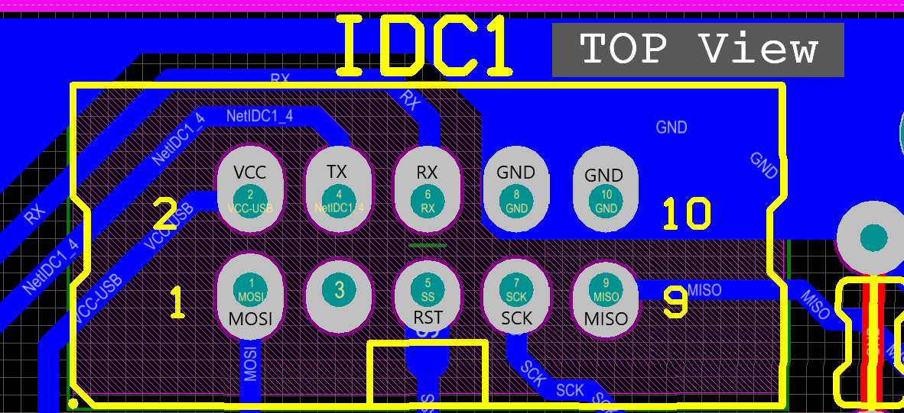

# USB-ASP AVR Microcontrollers Programmer
USB-ASP Programmer for AVR Microcontroller

https://SISOOG.com/ OPEN-LAB

Schematic + Firmware ->  from https://www.fischl.de/usbasp/

All the components are THD for education pourpose and you can make your own programmer PCB at home. [1-layer PCB]

